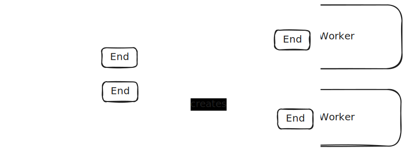

# An End of a Channel

The [`WxEnd`](/docs/types/internals.WxEnd) is the first layer of abstraction
over the JS messaging channels. It presents an *established* channel, meaning
when an `WxEnd` object exists, the underlying channel it encapsulates
must already exchanged the handshake and ready to send messages to each other.

Every channel has 2 ends, shown by the illustration below



```admonish note
This means you should only create one channel in the SDK per connection.
Having multiple channels for the same underlying connection is not supported.
However, the SDK supports having multiple protocols on the same channel.
See next chapters for details
```

```admonish note
An end does not map to a context: Any `Window` or `Worker` could
have multiple ends open, if they spawn multiple `Window` or `Worker`s. They
could also have an end open for their owner/creator, and one or more ends
open for any other `Window` or `Worker` they create.
```

At this level, there is no distinction between the active and passive side from
the API perspective: calling `close()` on either end of the channel will close the connection.
The underlying implementation may depend on if the side is active or passive,
but this is encapsulated.

Finally, the end also owns managing the underlying resource, meaning
if the messaging is done to a `Worker` or a popup `Window`, the will also be 
disposed of (terminated/closed). The only exception is embedded frames (`iframe`s).
Closing the connection for an embbeded frame with its embedder does not 
automatically remove the `iframe` element from the DOM.

```admonish note
This behavior is cascading. Suppose the main window opens a popup, and the popup
opens another popup (both using `workex`. When the main window is closed,
both popups will be closed.
```
