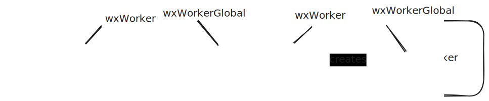

# Creator Functions

Finally, the creator functions are the entry points of this library.
They encapsulate everything explained in the chapters before. They
take in the config object to setup the [BUS](./bus.md), establish
the connection, agree on protocols, and return the linked interface 
implementation to call the other side.

There are five creator functions available, which can be divided into 2 groups:

- For workers:
    - [`wxWorker`](/docs/functions/public.wxWorker)
    - [`wxWorkerGlobal`](/docs/functions/public.wxWorkerGlobal)
- For windows:
    - [`wxPopup`](/docs/functions/public.wxPopup)
    - [`wxFrame`](/docs/functions/public.wxFrame)
    - [`wxWindowOwner`](/docs/functions/public.wxWindowOwner)

## Workers

`wxWorker` and `wxWorkerGlobal` are used for connecting to `Worker`s.
The passive side calls `wxWorker(worker)`, and the active side calls `wxWorkerGlobal`
to establish the connection using `globalThis`.

```admonish tip
See [Active and Passive Sides](./messaging.md#active-and-passive-sides) for
what active and passive means.

The [tutorial](../tutorial/usage_g.md) has full examples for setting up
connection for workers
```



## Windows

Windows are slightly more complicated. The global `Window` object
can both receive messages from its owner and the windows it owns.
The `source` of the `MessageEvent` tells where the message is sent.
This is encapsulated in the [`WxWindow`](/docs/types/public.WxWindow) object,
which is a handle/wrapper around the global `Window`. You don't need
to use this object directly.

For popups, the `wxPopup` creator function takes an URL and options, and
will open the popup window for you. For frames, the `wxFrame` takes
in an `HTMLIFrameElement` and only establish the connection (i.e. it doesn't
put the element in the DOM for you).

From the other side, the `wxWindowOwner` is used to connect to the owner side.
Since a window can't both be an embedded document and a popup at the same time,
it will automatically detect what scenario it is.

What it does need to know is the `origin` of the owner. This is because of
2 reasons:
- same-origin `Window`s run in the same context, and is considered trusted.
  In this case, `postMessage` is quite expensive, and the SDK uses a simple
  implementation to directly call the handler on the other end.
- For cross-origin `postMessage`, the sender must indicate the origin of the recipient.
  This is to prevent sending message to an untrusted context. For example,
  if the other window navigates to another website, you don't want to send your information
  to scripts on unknown websites. The browser will typically block these messages.

An easy way to do this, is to use a URL param when opening the popup or frame.

```typescript
// === on the main window (passive) side 
const origin = window.location.origin;

const result = await wxPopup(`https://mywebsite.com/popup.html?ownerOrigin=${origin}`)({
    /* your config object */
});

// === on the popup (active) side 
const ownerOrigin = new URLSearchParams(window.location.search).get("ownerOrigin");

const result = await wxWindowOwner(ownerOrigin)({
    /* your config object */
});
```

```admonish tip
The [multiwindow test app](https://github.com/Pistonite/workex/tree/main/packages/example-multiwindow/src/main.ts) has examples for how to use these creator functions
for windows
```
