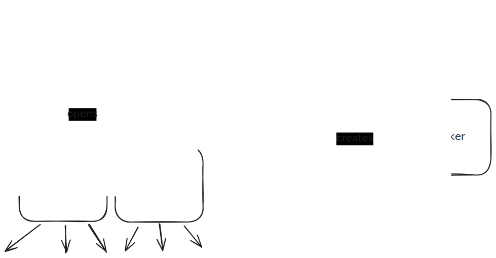

# JS Messaging Channel

Messaging in JS refers to passing JS objects between different contexts.
Different contexts do not have access to each other directly, such as the main thread
and worker threads, or windows with different origins. Messaging in JS
is done by calling `postMessage` on an object, typically a `Worker`, `WorkerGlobalScope`,
or a `Window` in the Web. The message will be delivered as a `MessageEvent`
to event listeners listening for the `"message"` event.

```admonish note
`Worker`, `WorkerGlobalScope`, and `Window` has slightly different behavior
when it comes to how `postMessage` works:
- Calling `postMessage` on a worker sends the message to the worker
- Calling `postMessage` on a `WorkerGlobalScope` sends the message to the 
  context that created the worker, on the worker object
  - Note in this case, `globalThis.postMessage` sends the message to the creator of the worker
- Calling `postMessage` on a `Window` sends the message to that `Window`.
  - Note in this case, `globalThis.postMessage` sends the message to the calling context itself
```

Therefore, messaging is only relevant when there are multiple JS contexts.
These are the usual ways how multiple JS contexts are usually involved or created:

- A `Window` object has a `parent` if it's embedded in another document, for example
  as an `iframe`.
- A `Window` object has a `opener` if it's opened by calling `window.open`.
- A `Window` object can open other `Window`s by calling `window.open`, or embed other
  documents (which can be same- or cross-origin).
- A `Window` object can spawn `Worker`s.
- A `Worker` can spawn other `Worker`s, but cannot open `Window`s.

This can be illustrated as a tree



## Active and Passive Sides

This brings the lowest-level concept in `Workex` - **Active** and **Passive** sides.
We call the context *created* by another context the **active** side,
and the context *creating* the other the **passive** side.

This distinction is important in 2 places:
- When initiating the communication
- When terminating the communication

The terminology is derived from the relationship of the 2 sides when **initiating**
the communication. Although major browsers have basically the same behavior,
the web standard actually does not specify when a new context created by an existing
context should start running. For example, when you call `new Worker()`, the worker
JS code can start executing immediately in a different thread (since it's a different
context, this is multithreaded JS), or, like how most browser implemented it,
does not start until the current JS task is done executing.

As a library, we do not want to rely on each browser implementing a specific behavior.
Therefore, we will assume that the existing context does not know when the new context
will start executing. This means to initiate the communication, the best way is to let
the new context send the first message (referred to as the handshake message), and
then the existing context will respond with a handshake message as well. The side that
sends the first handshake message is the active side, and the other the passive side.

It's also important when terminating the communication. Based on the diagram above,
we can see the direction of the arrow as a "ownership" relation. For example,
if a website creates a popup window, and the user closes the website, the popup
window should probably close as well (note this is not the default behavior for
popular browsers). We enforces this: the passive side is the owning side, and the active
side is the owned side, and the differences are:
- When communication is to be terminated, the owner (passive) side will definitely
  be notified in order for any necessary clean-up to run. The owned (active) side
  may not be notified, as the context may simply get destroyed
- The owned (active) side will not close itself even though it's technically possible.
  It will also "request" the owning side to close it, allowing the owner side to always
  be notified when the connection terminates, regardless of the implementation of the JS runtime.


