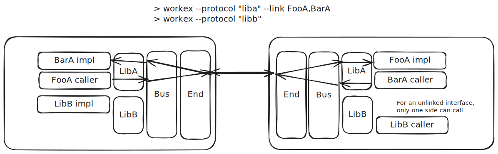

# Protocols

Protocols exist to solve 2 problems:
- The `workex` CLI tool ensures every function call can be uniquely identified
  by assigning a numeric ID to each function. However, it's possible that an application
  uses multiple sets of code generated by `workex`. We need an external method
  to tell these messages apart.
- One great use case for this library is custom plugins loaded as frames, popups,
  or workers. We need a way to version the generated code, so an update doesn't 
  break the application because the 2 sides don't have the same definition on
  what function `42` is, for example.

The following illustration shows 2 protocols operating on the same bus,
using the same underlying connection.



```admonish info
See the [tutorial](../tutorial/running_cli.md) for what the command means
```

For ergnomics and to simplify the implementation, the BUS enforces
that each protocol can only register one connection. The protocols
are registered at BUS-creation time, by passing in an implementation
of one of the ends and calling a "binding function" generated by
the CLI tool. The BUS will then automatically return an implementation
of the linked interface. Calling functions on that interface
will invoke the implementation on the other side through RPC,
but it all feels like regular async function call.

```typescript

// `wxCreateBus` is an internal function, so this is just
// pseudo code to demonstrate the concept - error handling is also omitted
const barAImpl: BarA = {
    /* ... implements the interface */
};
// wxCreateBus will handle all the handshake, protocol agreement, etc
const { fooA } = await wxCreateBus({
    // the bind config functions are generated by CLI
    fooA: bindBarA(barAImpl)
});
// use fooA, which implements FooA
```

To solve the second problem on the top, the BUS will send protocol query messages
and agree on the protocols and interface types before accepting any other message.
For example, if side A receives a `bindBarA` config, then it knows the other side
must provide a `FooA` implementation in the same protocol. If the other side agrees,
then the protocols are agreed, and RPCs can start. 

When breaking changes to a library is made, the protocol can be changed (e.g.
`my-lib-v1` to `my-lib-v2`). This will cause outdated plugins to have a protocol
disagreement, and prevent further breakage.

```typescript
// the error is returned by the creator function in real code
const result = await wxCreateBus({...});
if (result.err) {
    if (result.err.code === "ProtocolDisagree") {
        // tell author of the plugin
        console.error("Hey! Please update the version of my-lib in your package.json!");
        return;
    }
}
```

```admonish tip
Both sides will receive this error, so it's also helpful to have a nice user-friendly
UI in the main app that explains to the user why they can't use the plugin.
```
